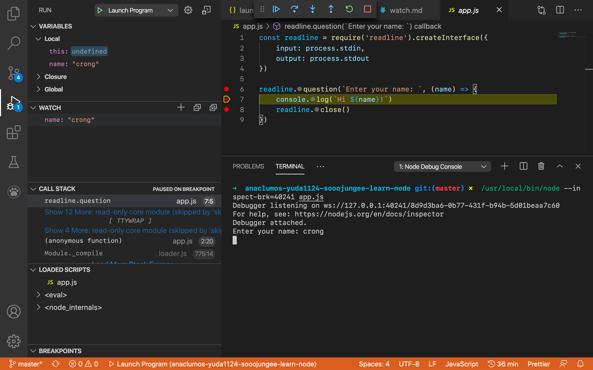

# Watch 사용법

- Debug 창 왼쪽에 있는 메뉴 중 하나이다.
- Expressions 들을 등록하면 그 값들을 모니터링(watch)할 수 있다.

## 예시

```javascript
const readline = require('readline').createInterface({
    input: process.stdin,
    output: process.stdout
})

readline.question(`Enter your name: `, (name) => {
    console.log(`Hi ${name}!`)
    readline.close()
})
```

- 예시 코드는 이름을 입력받아 `name`이라는 변수에 저장하여 다시 출력하는 코드이다.
- Watch에서 `name`을 등록해두자 등록한 `name`의 값이 나타나는 것을 확인할 수 있다.

